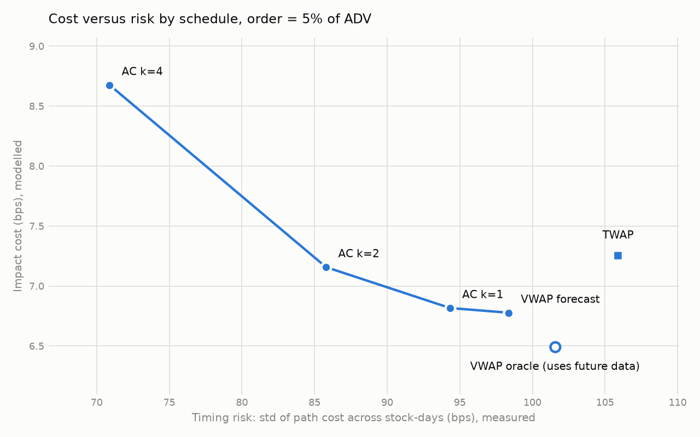

# execbench: benchmarking execution schedules by implementation shortfall

Built with an LLM coding assistant. I directed the design, ran it on real data and audited the results.

**Question.** For a parent order worked over one trading day, how do TWAP, VWAP and
front-loaded Almgren-Chriss schedules compare on cost and on risk, and how much does an
out-of-sample volume forecast actually help?

## What is measured and what is assumed

This distinction is the point of the project. Historical bars show prices that already
happened; a simulated order cannot move them. So:

| Quantity | Source | Depends on an impact model? |
|---|---|---|
| Volume curve forecast error | measured, out-of-sample | no |
| VWAP tracking error (schedule price vs market VWAP) | measured | no |
| Timing risk (spread of path cost across stock-days) | measured | no |
| Share of the TWAP-to-oracle gap closed by the forecast | measured volumes, modelled cost | only through the exponent beta |
| Impact cost in bps | **assumed** | yes, fully |

Under any impact model where cost rises with participation rate, trading in proportion
to realised volume minimises temporary impact **by construction** (there is a unit test
for this). "VWAP has lower impact than TWAP" is therefore an assumption of the model,
not a finding. The findings are the measured rows above.

## Method

- **Data.** 1-minute consolidated US equity bars, regular session only, aggregated to
  5-minute buckets (78 per day). Early-close days are dropped and listed by date: a
  day is kept only if its final hour holds at least 5% of the day's volume. (Checking
  for empty buckets is not enough: on a 13:00 close, liquid stocks keep printing thin
  after-hours trades until 16:00.)
- **Point-in-time inputs.** Before each day opens, from the previous 20 trading days
  only: average daily volume, daily volatility, and the mean share of volume per bucket
  (the volume curve forecast). A unit test perturbs day *d* and checks that day *d*'s
  inputs do not change.
- **Order.** Buy 1%, 5% or 10% of forecast ADV, from the open to the close.
- **Schedules.** TWAP; VWAP on the forecast curve; Almgren-Chriss trajectory on the
  forecast volume clock at urgency kappa = 1, 2, 4 (kappa = 0 is VWAP); and an oracle
  VWAP on the realised curve, shown only as an unreachable bound.
- **Implementation shortfall** against the arrival price (first print of the session),
  split into path cost (price drift while waiting) and impact cost.
- **Impact model.** Temporary: `eta * sigma * (x_k / V_k)^beta`. Permanent:
  `gamma * sigma * q / ADV`. Defaults eta = 0.142, gamma = 0.314, beta = 0.5
  (square-root law), with beta swept over 0.4 to 1.0.
- **Statistics.** Stocks move together within a day, so stock-days are not independent.
  Every confidence interval resamples whole dates, not rows.

## Run it

```bash
pip install -r requirements.txt
python -m pytest -q                       # 35 tests against hand-worked and theoretical answers

# real data (free Alpaca paper account)
export APCA_API_KEY_ID=...  APCA_API_SECRET_KEY=...
python scripts/fetch_alpaca.py --start 2025-09-01 --end 2026-09-30
python scripts/run_benchmark.py --data data --out results

# no API key: synthetic data with a known answer (not market data, never quote it)
python scripts/make_synthetic.py
python scripts/run_benchmark.py --data data_synth --out results_synth --synthetic
```

## Results

12 large-cap US stocks, 1 Oct 2025 to 30 Sep 2026: 2,988 stock-days over 249 dates.
Two early-close days (28 Nov, 24 Dec 2025) dropped for all symbols.

**Measured (no impact model)**

| | Flat / TWAP | 20-day forecast / VWAP | Reduction (95% CI, by date) |
|---|---|---|---|
| Volume in the wrong bucket | 25.4% | 14.8% | 10.6 pts (10.4 to 10.8) |
| VWAP tracking error, bps | 7.90 | 4.94 | 2.96 (2.60 to 3.29) |

Mean intraday drift on buys was +3.2 bps (CI -1.4 to 7.6): not distinguishable from zero.

**Cost versus risk, order = 5% of ADV** (impact modelled, risk measured)

| Schedule | Impact, bps | Timing risk, bps |
|---|---|---|
| TWAP | 7.25 | 105.9 |
| VWAP forecast | 6.78 | 98.4 |
| AC kappa=1 | 6.82 | 94.3 |
| AC kappa=2 | 7.16 | 85.8 |
| AC kappa=4 | 8.68 | 70.9 |
| VWAP oracle (uses future data) | 6.49 | 101.6 |

The forecast closes 62.5% (CI 61.6% to 63.4%) of the modelled impact gap between TWAP
and the oracle. This ratio is independent of eta and order size and stable for beta
from 0.4 to 1.0 (62.4% to 62.9%).



**A bug the first real-data run exposed.** Early-close days passed the completeness
filter because liquid stocks print thin after-hours trades until 16:00. It showed up as
simulated orders exceeding market volume in hundreds of buckets. Fixed with a
final-hour volume rule and a regression test. 242 capped buckets remain out of roughly
3.5 million schedule-bucket combinations, almost all for the most front-loaded
schedule at 10% of ADV on thin days.

## Tests

Each test compares the code with an answer worked out independently, for example:

- price 1% above arrival in every bucket costs exactly 100 bps for any schedule
- linear permanent impact costs `gamma * sigma * (X/ADV) / 2` whatever the schedule
- TWAP timing risk on a random walk matches `sigma * sqrt((n+1)(2n+1)/(6n))`, in
  Monte Carlo and end to end through the bar pipeline
- on synthetic data with a **flat** true volume curve, the forecast shows no skill
  (guards against manufacturing skill from noise)

## Limitations

- Impact parameters are assumed, not estimated. Without proprietary fill data they
  cannot be calibrated. Absolute bps figures are illustrative; rankings and the
  measured quantities are the output.
- Fills are assumed at each bucket's market VWAP. No spread, fees, queue position or
  fill uncertainty.
- The opening bucket may include auction volume; the closing auction is excluded.
- The Almgren-Chriss trajectory is optimal only under linear temporary impact. It is
  used here as a one-parameter family of front-loaded schedules.
- The universe is a fixed list of large, liquid US stocks chosen before any result was
  seen. Nothing here says anything about illiquid names.
- Buy orders only. Mean path cost is intraday drift, reported with its interval, and
  is not schedule skill.

## References

- Perold (1988), "The Implementation Shortfall: Paper versus Reality".
- Almgren and Chriss (2000), "Optimal Execution of Portfolio Transactions".
- Almgren, Thum, Hauptmann and Li (2005), "Direct Estimation of Equity Market Impact".
